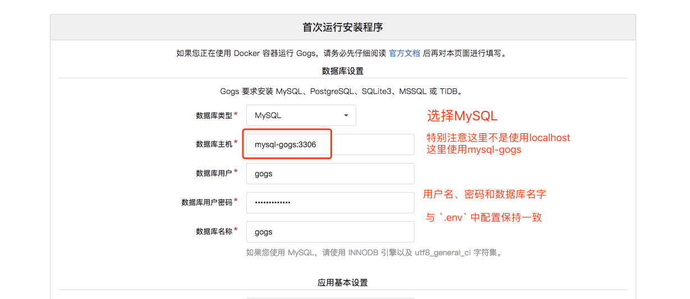

使用Docker搭建私有的 GOGS
==========================================================

## 依赖环境
* [Docker](https://docs.docker.com/linux/step_one/) (>= 1.10.3)
* [docker-compose](https://docs.docker.com/compose/install/) (>= 1.6.2)

## 首次运行

使用ip+端口的方式登录gogs初始化页面，将看到如下界面：



# 构建
升级完成系统依赖环境后，进入到项目目录执行下面的命令：

```
docker-compose up -d
```


# 参考
* [msis/docker-compose-nginx-gogs](https://github.com/msis/docker-compose-nginx-gogs)
* [gogs/docker github](https://github.com/gogits/gogs/tree/master/docker)
* [Unknown blog post](https://unknwon.io/setup-gogs-with-https/)
* [ANAND MANI SANKAR blog post](http://anandmanisankar.com/posts/docker-container-nginx-node-redis-example/)
* [DigitalOcean Tutorial 1](https://www.digitalocean.com/community/tutorials/understanding-the-nginx-configuration-file-structure-and-configuration-contexts)
* [DigitalOcean Tutorial 2](https://www.digitalocean.com/community/tutorials/how-to-run-nginx-in-a-docker-container-on-ubuntu-14-04)
* [stackoverflow question](http://stackoverflow.com/questions/21181231/server-certificate-verification-failed-cafile-etc-ssl-certs-ca-certificates-c)
* [misho gist](https://gist.github.com/micho/1712812)
* [docker compose on networking](https://docs.docker.com/compose/networking/)
* [docker on links](https://docs.docker.com/engine/userguide/networking/default_network/dockerlinks/)
